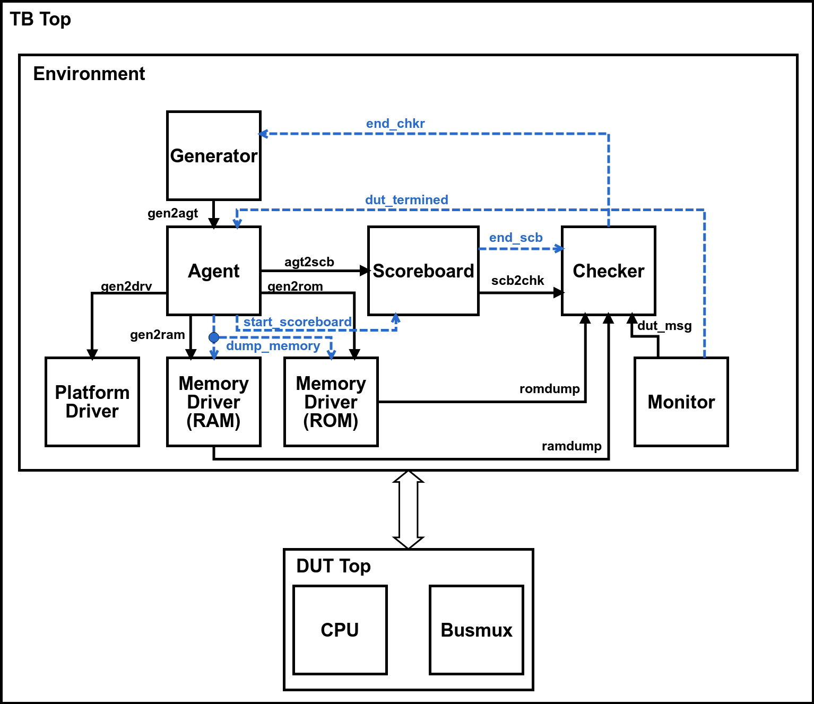

# HF-RISC Functional Verification Environment

This verification environment, built with SystemVerilog, executes the DUT and a RISC-V reference model to compare both results.
There are two types of verification: *at the end of the program execution*, by comparing the reference model's memory 
against the DUT's memory; *instruction by instruction*, comparing reg bank and other internal registers.

The directory *testcases* includes the directed testcases used for verification. For every testcase executed, functional coverage 
metrics are extracted and there is a script to merge the functional coverage database.

The directory *randomtest* includes pre-processing scripts to randomly generate Assembly code. These codes are simulated and 
functional coverage metrics are generated into the database. 

The following image shows the *architecture of the testbench* and its main modules.

---
### Verification at the End of Program Execution

how to run it

---
### Verification Instruction by Instruction

how to run it

