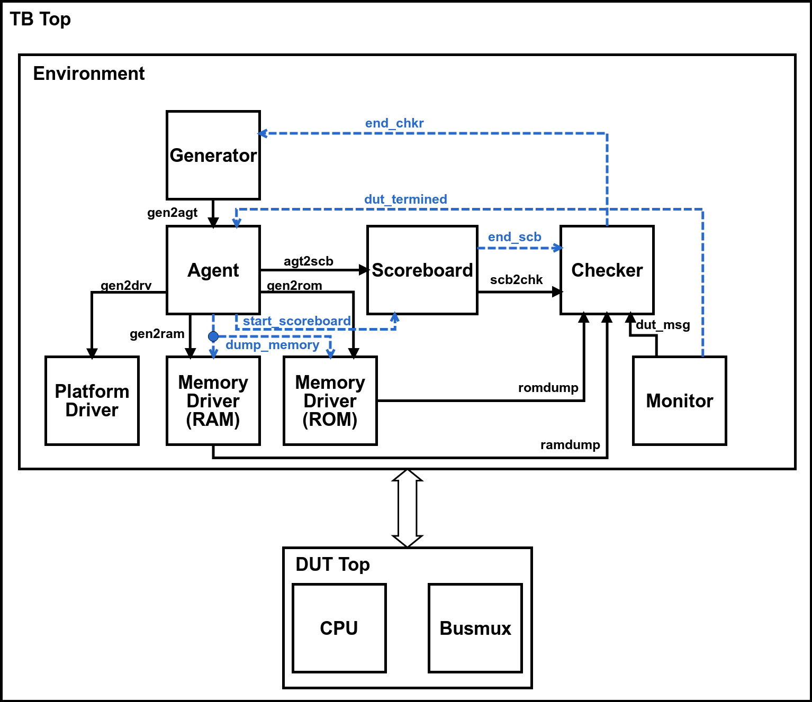

# HF-RISC Functional Verification Environment

This verification environment, built with SystemVerilog, executes the DUT and a RISC-V reference model to compare both results.
There are two types of verification: *at the end of the program execution*, by comparing the reference model's memory 
against the DUT's memory; *instruction by instruction*, comparing reg bank and other internal registers.

The directory *testcases* includes the directed testcases used for verification. For every testcase executed, functional coverage 
metrics are extracted and there is a script to merge the functional coverage database.

The directory *randomtest* includes pre-processing scripts to randomly generate Assembly code. These codes are simulated and 
functional coverage metrics are generated into the database. 

The following image shows the *architecture of the testbench* and its main modules. The dashed arrows represent events and the normal arrows represent mailboxes.



---
### Verification at the End of Program Execution

To run the verification at the End of Program Execution, follow the next steps:
1. Go to the software directory: <br />
   ```
   cd software/
   ```
2. Compile the application: <br />
   ```
   make clean <app>
   ```
   - The `<app>` parameter can assume the following values:
      - coremark
      - core_test
      - euler
      - exp_io
      - fib
      - hanoi
      - hello
      - interrupt_test
      - newton
      - pi
      - sort
      - test64
      - test_crc
      - test_fp
      - test_trig
      - test_spi
      - xtea	
      - xtea_hw
      - xtea_hw_vec
      - aes_tiny
      - aes_lite
      - test
3. Copy the code.txt file to the verification directory: <br />
   ```
   cp code.txt ../hf-riscv/sv_verif/
   ```  
4. Go to the verification directory: <br />
   ```
   cd ../hf-riscv/sv_verif/
   ```
5. Load the Modelsim tool: <br /> 
   ```
   module load modelsim
   ```
6. Run the simulation: <br />
   - To run with graphic interface: <br />
      ```
      vsim -do sim_environment.do
      ```
   - To run without graphic interface: <br />
      ```
      vsim -c -do sim_environment.do
      ```    
---
### Verification with Merged Coverage

To run the verification with Merged Coverage, follow the next steps:
1. Go to the test cases directory: <br />
   ```
   cd hf-riscv/sv_verif/testcases/
   ```
2. Load the Modelsim tool: <br /> 
   ```
   module load modelsim
   ```
3. Execute the Merged Coverage script: <br /> 
   ```
   ./run_all.sh
   ```
4. Generate the HTML coverage file: <br /> 
   ```
   vcover report -html -htmldir coverage -verbose -threshL 50 -threshH 90 total_coverage.ucdb
   ```
5. Open the HTML coverage file: <br /> 
   ```
   cd coverage/
   firefox covsummary.html &
   ```
---
### Verification with Random Applications

To run the verification with Merged Coverage, follow the next steps:
1. Go to the random test directory: <br />
   ```
   cd hf-riscv/sv_verif/randomtest/
   ```
2. Load the Modelsim tool: <br /> 
   ```
   module load modelsim
   ```
3. Execute the Merged Coverage script: <br /> 
   ```
   ./run_all.sh
   ```
4. Generate the HTML coverage file: <br /> 
   ```
   cd apps/
   vcover report -html -htmldir coverage -verbose -threshL 50 -threshH 90 total_coverage.ucdb
   ```
5. Open the HTML coverage file: <br /> 
   ```
   cd coverage/
   firefox covsummary.html &
   ```
